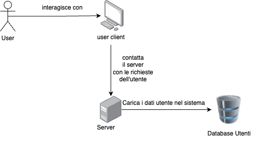
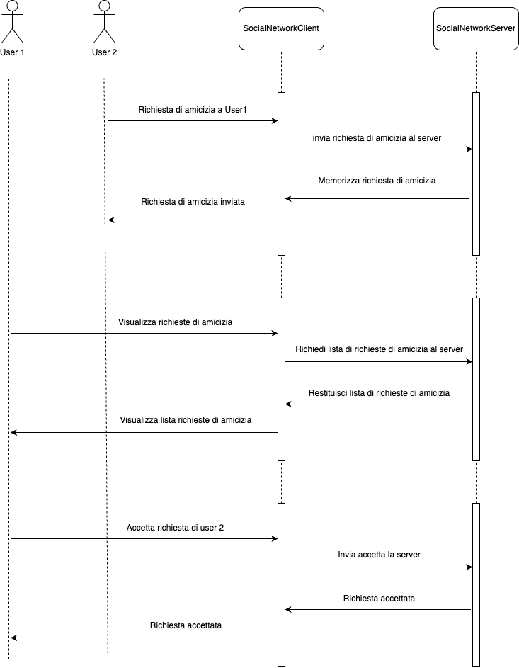
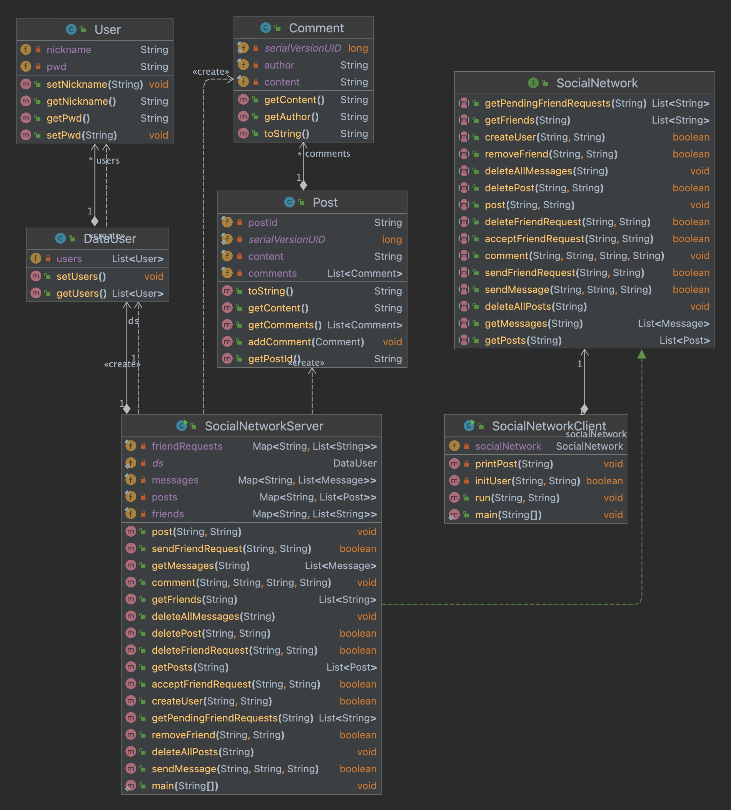

# Documento di Specifica dei Requisiti Software

## 1. Introduzione

### 1.1 Obiettivo del documento

Lo scopo del presente documento è definire i requisiti del sistema di social network al fine di fornire una guida chiara
e completa per gli sviluppatori durante la fase di progettazione e implementazione del sistema.

### 1.2 Contesto del sistema

Il sistema di social network permette agli utenti di creare account, gestire le amicizie, inviare messaggi, pubblicare
post e commentare i post degli amici.

### 1.3 Scopo del sistema

Il sistema di social network permette agli utenti di interagire tra loro attraverso richieste di amicizia,
messaggistica, pubblicazione di post e commenti. Il sistema fornisce una piattaforma online per la connessione e la
comunicazione tra gli utenti registrati.

## 2. Descrizione generale

### 2.1 Funzionalità del sistema

Il sistema di social network fornisce le seguenti funzionalità principali:

1. Accesso al sistema social network:
    - Gli utenti possono accedere al proprio account fornendo il nome utente e password.

2. Gestione delle amicizie:
    - Gli utenti possono inviare richieste di amicizia ad altri utenti.
    - Gli utenti possono accettare o rifiutare le richieste di amicizia ricevute.
    - Gli utenti possono rimuovere un amico dalla lista degli amici.

3. Messaggistica:
    - Gli utenti possono inviare messaggi ad altri utenti nella loro lista di amici.
    - Gli utenti possono visualizzare i messaggi ricevuti.
    - Gli utenti possono cancellare i messaggi ricevuti.

4. Pubblicazione di post:
    - Gli utenti possono scrivere e pubblicare post sul loro profilo.
    - Gli utenti possono visualizzare i post pubblicati sul loro profilo.
    - Gli utenti possono cancellare i propri post.

5. Commenti sui post:
    - Gli utenti possono commentare i post degli amici.
    - Gli utenti possono visualizzare i commenti associati a un post.

### 2.2 Caratteristiche del sistema

Il sistema di social network presenta le seguenti caratteristiche:

- Accesso sicuro: Il sistema garantisce l'accesso sicuro alle informazioni dell'utente tramite autenticazione.
- Gestione delle amicizie: Gli utenti possono gestire la loro lista di amici attraverso richieste di amicizia e
  rimozione degli amici.
- Messaggistica: Gli utenti possono inviare e ricevere messaggi tra loro.
- Pubblicazione di post: Gli utenti possono scrivere e pubblicare post sul loro profilo.
- Commenti sui post: Gli utenti possono commentare i post degli amici.

## 3. Requisiti specifici

### 3.1 Requisiti funzionali

#### 3.1.1 Creazione di un utente

R1: Gli utenti devono poter accedere al sistema fornendo le proprie credenziali di accesso (nome utente e password).  
R2: Il sistema deve verificare la validità delle credenziali di accesso confrontandole con i dati utente memorizzati su
un file CSV.  
R3: Se le credenziali di accesso fornite dall'utente corrispondono ai dati utente memorizzati, l'utente viene
autenticato e può accedere al sistema.

#### 3.1.2 Gestione delle amicizie

R4: Gli utenti devono poter inviare richieste di amicizia ad altri utenti fornendo il nome utente del destinatario.  
R5: Il sistema deve verificare l'esistenza dell'utente destinatario e la non duplicazione delle richieste di amicizia.  
R6: Il destinatario deve poter visualizzare le richieste di amicizia in sospeso e accettarle o rifiutarle.  
R7: Se una richiesta di amicizia viene accettata, l'utente mittente e il destinatario diventano amici reciprocamente.  
R8: Gli utenti devono poter rimuovere un amico dalla lista degli amici.

#### 3.1.3 Messaggistica

R9: Gli utenti devono poter inviare messaggi ad altri utenti nella loro lista di amici.  
R10: Il sistema deve verificare se l'utente mittente e il destinatario sono amici prima di inviare il messaggio.  
R11: Gli utenti devono poter visualizzare i messaggi ricevuti.  
R12: Gli utenti devono poter cancellare i messaggi ricevuti.

#### 3.1.4 Pubblicazione di post

R13: Gli utenti devono poter scrivere e pubblicare post sul loro profilo.  
R14: I post devono contenere un identificatore univoco (UUID) e un contenuto testuale.  
R15: Gli utenti devono poter visualizzare i post pubblicati sul loro profilo.  
R16: Gli utenti devono poter cancellare i propri post specificando l'identificatore del post.

#### 3.1.5 Commenti sui post

R17: Gli utenti devono poter commentare i post degli amici.  
R18: I commenti devono contenere l'autore del commento e il contenuto testuale.  
R19: I commenti devono essere associati al post corrispondente.  
R20: Gli utenti devono poter visualizzare i commenti associati a un post.

## 4. Descrizione dell'architettura

Il sistema di social network è progettato seguendo un'architettura **client-server** che utilizza il protocollo RMI
(Remote Method Invocation) per la comunicazione tra client e server. L'architettura è suddivisa in due componenti
principali: il lato client e il lato server.

### 4.1 Lato Client

Il lato client rappresenta l'interfaccia utente del sistema di social network. È responsabile per la presentazione dei
dati e delle funzionalità agli utenti. Il client comunica con il server per richiedere l'esecuzione delle operazioni e
per ricevere i risultati.

### 4.2 Lato Server

Il lato server gestisce tutte le operazioni di elaborazione dei dati e la logica di business del sistema di social
network. Riceve le richieste dai client, le elabora e restituisce i risultati appropriati.

Il server è implementato come un'applicazione Java che implementa l'interfaccia `SocialNetwork`. Utilizza la
classe `SocialNetworkServer` che estende `UnicastRemoteObject` per fornire il supporto RMI. Il server mantiene le
informazioni degli utenti, le richieste di amicizia, i messaggi, i post e i commenti utilizzando diverse strutture dati
come mappe e liste. Inoltre, il server si occupa della persistenza dei dati utente, che sono memorizzati su un
file CSV. Durante l'avvio, il server legge il file CSV e carica i dati utente nel sistema.

### 4.3 Comunicazione tra Client e Server

La comunicazione tra il client e il server avviene utilizzando il protocollo RMI. Il client ottiene un riferimento
remoto all'oggetto del server tramite il servizio di registrazione RMI. Utilizzando questo riferimento, il client invoca
i metodi dell'interfaccia `SocialNetwork` per eseguire le operazioni desiderate.

Quando il client invoca un metodo, la richiesta viene inoltrata al server tramite il protocollo RMI. Il server esegue
l'operazione richiesta e restituisce i risultati al client. La comunicazione avviene in modo trasparente, come se il
client e il server fossero eseguiti sulla stessa macchina, anche se in realtà possono essere eseguiti su macchine
diverse in una rete.

### Diagramma di sequenza 
#### Esempio invio richiesta di amicizia

### UML

## 5. Glossario

- Account: Rappresenta l'identità di un utente nel sistema di social network.
- Amicizia: Rappresenta la connessione tra due utenti che hanno accettato reciprocamente una richiesta di amicizia.
- Messaggio: Rappresenta una comunicazione testuale inviata da un utente a un altro utente nel sistema.
- Post: Rappresenta un messaggio pubblico condiviso da un utente sul proprio profilo.
- Commento: Rappresenta un commento associato a un post, scritto da un utente.
